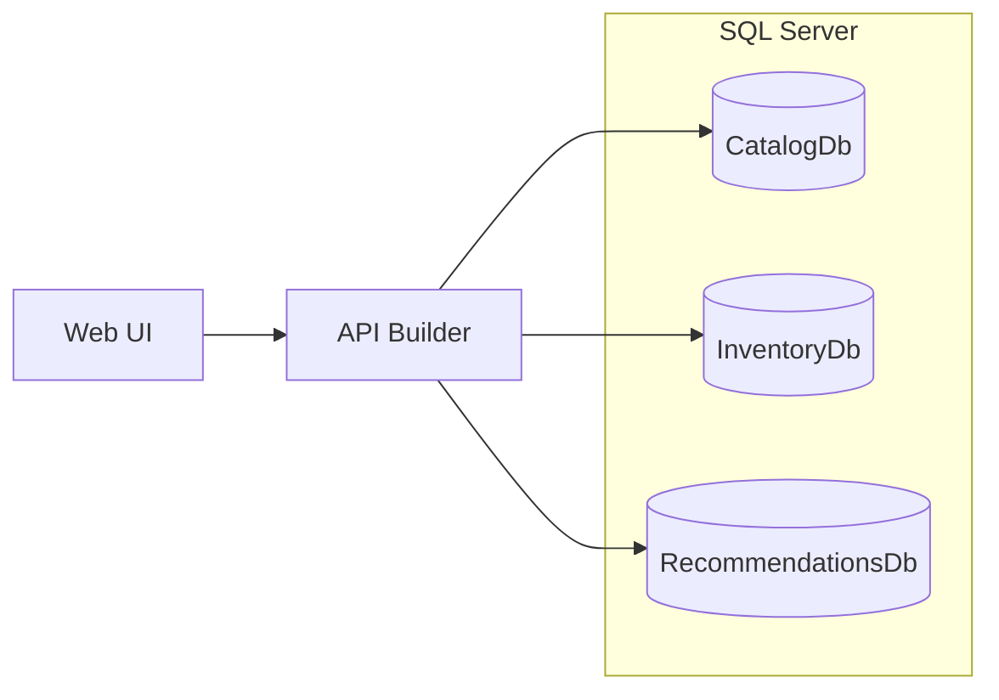
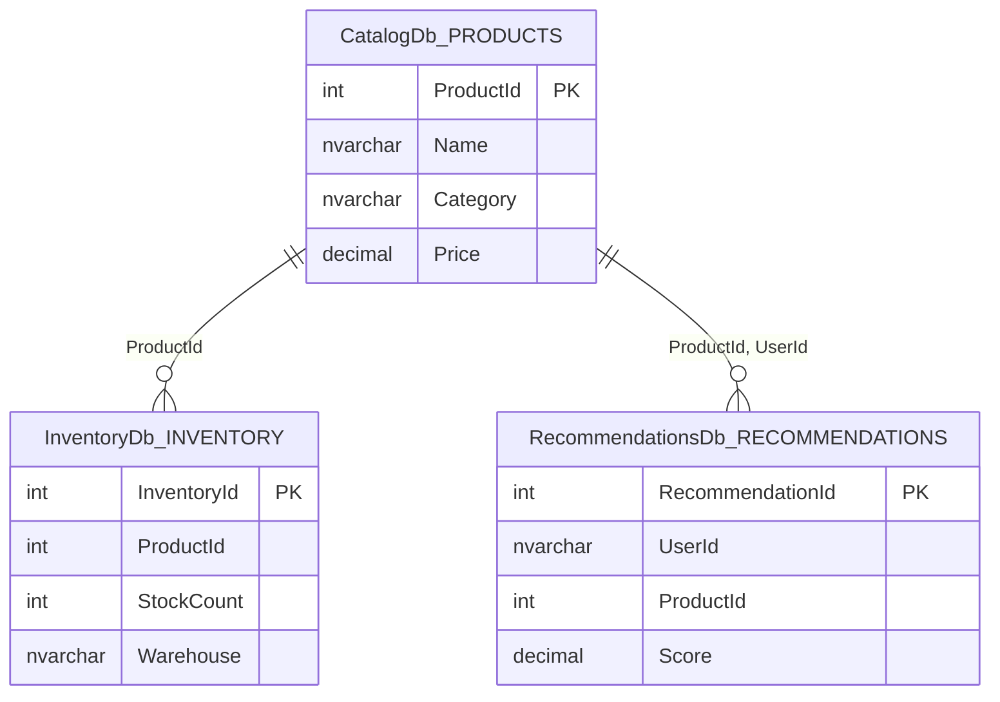

# Multi-Source DAB Demo

Demonstrates Data API Builder's **multi-source config** — one master config with three child configs, each pointing to a separate database.

## Services

Aspire orchestrates all services. One SQL Server hosts three databases. One DAB instance serves all three via multi-source config files.

| Service | Purpose |
|---------|---------|
| SQL Server | Hosts all three databases |
| API Builder (DAB) | GraphQL + REST API via multi-source config |
| Web UI | ASP.NET Core Razor Pages, queries DAB GraphQL |
| Aspire Dashboard | Monitoring at `:15888` |

## Data model across the three databases

