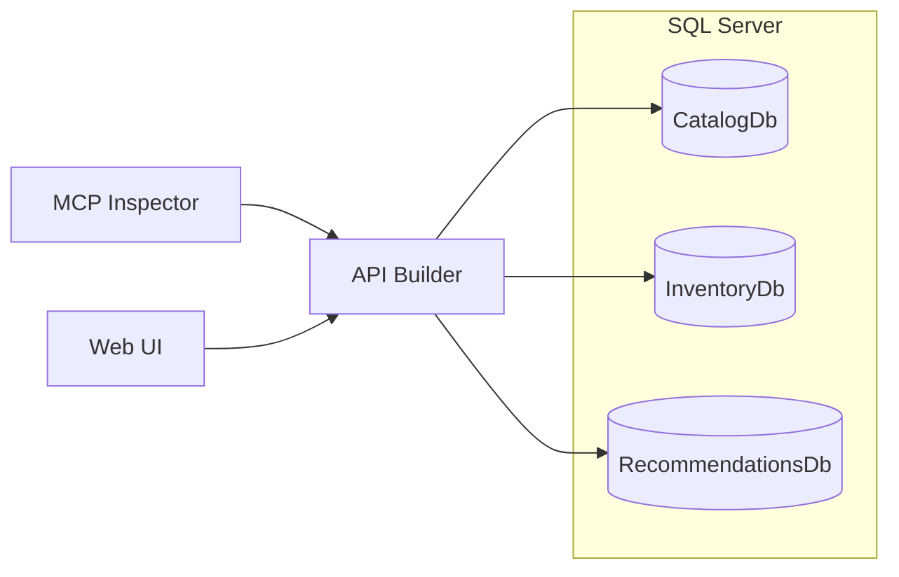
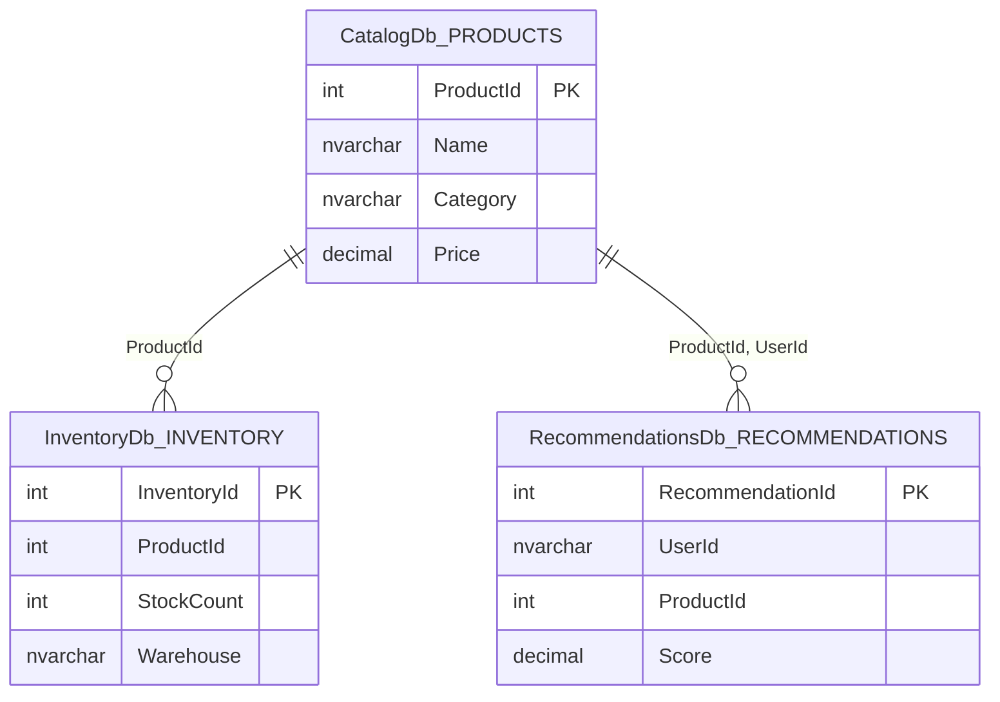

# Multi-Source DAB Demo

Demonstrates Data API Builder's **multi-source config** — one master `dab-config.json` with three child configs, each pointing to a separate SQL Server database. A single DAB instance exposes REST, GraphQL, and MCP endpoints across all three.

## Architecture

.NET Aspire orchestrates all services locally. One SQL Server container hosts three databases. One DAB container serves them all.



| Service | URL | Purpose |
|---------|-----|---------|
| Aspire Dashboard | `http://localhost:5001` | Logs, metrics, health |
| API Builder (DAB) | `http://localhost:5005` | REST + GraphQL + MCP |
| Web UI | `http://localhost:5006` | Razor Pages demo app |
| MCP Inspector | `http://localhost:6274` | Interactive MCP debugger |
| SQL Server | `localhost:5007` | Three databases |

## Prerequisites

- [.NET 10 SDK](https://dotnet.microsoft.com/download)
- [Docker Desktop](https://www.docker.com/products/docker-desktop/) (running)
- [Node.js 22+](https://nodejs.org/) (for MCP Inspector)

## Run

```bash
# First run — build then launch
dotnet build
dotnet run --project Aspire.AppHost
```

Or press **F5** in VS Code — the launch config kills any prior instance, builds, and starts.

## Try the APIs

Open `demo.http` in VS Code (REST Client extension) for one-click requests, or use the DAB Swagger UI at `http://localhost:5005/swagger`.

**REST**
```
GET http://localhost:5005/api/products
GET http://localhost:5005/api/inventory
GET http://localhost:5005/api/recommendations
```

**GraphQL** — `http://localhost:5005/graphql`
```graphql
{
  products { items { ProductId Name Category Price } }
  inventories { items { InventoryId ProductId StockCount Warehouse } }
  recommendations { items { RecommendationId UserId ProductId Score } }
}
```

**MCP Inspector** — open `http://localhost:6274`, select `data-api`, click **Connect**.

## Data Model



## Project Structure

```
api/                        # DAB config files (multi-source)
  dab-config.json           # Master config
  dab-config-catalog.json
  dab-config-inventory.json
  dab-config-recommendations.json
database/                   # SQL creation scripts (run at startup)
  CatalogDb.sql
  InventoryDb.sql
  RecommendationsDb.sql
Aspire.AppHost/             # Orchestration (Program.cs)
web/                        # Razor Pages Web UI
demo.http                   # Sample REST + GraphQL requests
```


